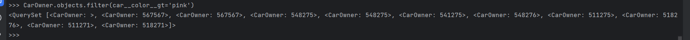
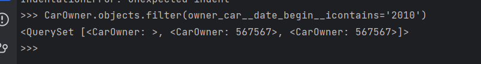
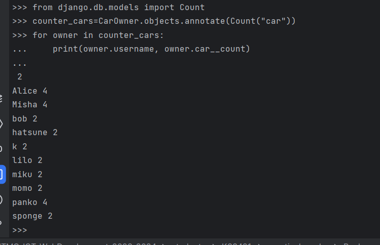

## Практика 3.1

Задание 1.

Напишите запрос на создание 6-7 новых автовладельцев
Воспользуемся интерактивным режимом интерпретатора:
```python
new_driver = CarOwner(passport="541275", nationality="RU", birth_date='1999-01-02', username='miku')
new_driver.save()
new_driver = CarOwner(passport="548276", nationality="RU", birth_date='1999-01-03', username='hatsune')
new_driver.save()
new_driver = CarOwner(passport="511275", nationality="RU", birth_date='1999-01-04', username='sponge')
new_driver.save()
new_driver = CarOwner(passport="518276", nationality="RU", birth_date='1999-01-06', username='bob')
new_driver.save()
new_driver = CarOwner(passport="511271", nationality="RU", birth_date='1999-01-07', username='lilo')   
new_driver.save()                                                                                    
new_driver = CarOwner(passport="518271", nationality="RU", birth_date='1999-01-08', username='momo') 
new_driver.save()                                                                                    ```
```
и 5-6 автомобилей аналогично:
```python
new_car = Car(gov_number="272324", car_make="121232", model="car_model", color="pink")  
new_car.save()                                                                         
new_car = Car(gov_number="172124", car_make="122312", model="car_model", color="pink")  
new_car.save()                                                                         
new_car = Car(gov_number="237824", car_make="221232", model="car_model", color="pink") 
new_car.save()                                                                         
new_car = Car(gov_number="17232", car_make="121902", model="car_model", color="pink") 
new_car.save()                                                                         
new_car = Car(gov_number="2372324", car_make="267832", model="car_model", color="pink")  
new_car.save()
```

Каждому автовладельцу назначьте удостоверение и от 1 до 3 автомобилей
Напишем скрипт:
```python
from datetime import datetime

# add licence to each owner
for i, owner in enumerate(CarOwner.objects.all()):
    license = DriversLicence(owner_car=owner, licence_number=f"0877{i}939", type="Valid", given_at="2023-07-25")
    license.save()
    new_car = Car(gov_number=f"27232{i}", car_make=f"121232{i}", model="car_model", color="pink")
    new_car.save()
    car_ownership = CarOwnership(car=new_car, owner=owner, date_begin=datetime.today().strftime('%Y-%m-%d'))
    car_ownership.save()
```
Результат:


Задание 2.

Выведете все машины марки “Toyota” (или любой другой марки, которая у вас есть)

```python
Car.objects.filter(model='car_model')
```
Результат:


Найти всех водителей с именем “miku” (или любым другим именем на ваше усмотрение)

```python
 CarOwner.objects.filter(username='miku')  
```

Результат:


Взяв любого случайного владельца получить его id, и по этому id получить экземпляр удостоверения
в виде объекта модели (можно в 2 запроса)

```python
DriversLicence.objects.filter(owner_car=CarOwner.objects.filter(username='miku')[0].id)       
```

Результат:


Вывести всех владельцев розовых машин (или любого другого цвета, который у вас присутствует)

```python
CarOwner.objects.filter(car__color__gt='pink')
```

Результат:


Найти всех владельцев, чей год владения машиной начинается с 2010 (или любой другой год, который присутствует у вас в базе)

```python
CarOwner.objects.filter(owner_car__date_begin__icontains='2010')      
```

Результат:


Задание 3

Вывод даты выдачи самого старшего водительского удостоверения

DriversLicence.objects.aggregate(oldest_licence=Min('given_at'))        


Укажите самую позднюю дату владения машиной, имеющую какую-то из существующих моделей в вашей базе


Выведите количество машин для каждого водителя

```python
from django.db.models import Count
counter_cars=CarOwner.objects.annotate(Count("car"))
for owner in counter_cars:
    print(owner.username, owner.car__count)
```



Подсчитайте количество машин каждой марки

```python
Car.objects.values("model").annotate(Count("id"))
```


Отсортируйте всех автовладельцев по дате выдачи удостоверения (Примечание: чтобы не выводить несколько раз одни и те же таблицы воспользуйтесь методом .distinct()

```python
 DriversLicence.objects.order_by("given_at")           
```


