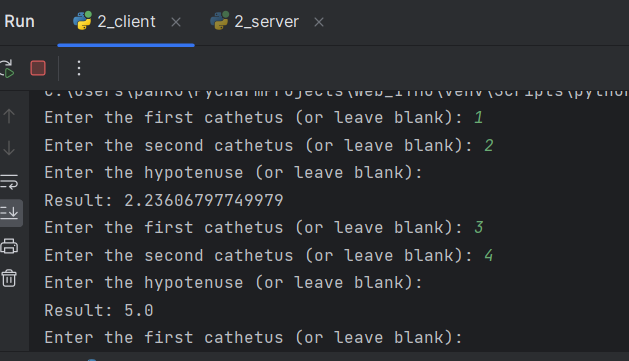

## Задача №2

Реализовать клиентскую и серверную часть приложения. Клиент запрашивает у сервера выполнение математической операции, параметры которой вводятся с клавиатуры. 
Сервер обрабатывает полученные данные и возвращает результат клиенту. 

Вариант – теорема Пифагора.

## Решение

1. Сервер

```
import socket

def calculate_side(a, b, c):
    if a is None:
        return (c**2 - b**2)**0.5
    elif b is None:
        return (c**2 - a**2)**0.5
    elif c is None:
        return (a**2 + b**2)**0.5

def handle_client(conn):
    while True:
        data = conn.recv(1024)
        if not data:
            break
        args = data.decode().split(',')
        a = float(args[0]) if args[0] else None
        b = float(args[1]) if args[1] else None
        c = float(args[2]) if args[2] else None
        result = calculate_side(a, b, c)
        conn.send(str(result).encode())
    conn.close()

HOST = '127.0.0.1'
PORT = 5000

with socket.socket(socket.AF_INET, socket.SOCK_STREAM) as s:
    s.bind((HOST, PORT))
    s.listen()
    print(f'Server started on {HOST}:{PORT}')
    while True:
        conn, addr = s.accept()
        print(f'Connected by {addr}')
        handle_client(conn)

```

2. Клиент

```

import socket

HOST = '127.0.0.1'
PORT = 5000

def get_input():
    a = input('Enter the first cathetus (or leave blank): ')
    b = input('Enter the second cathetus (or leave blank): ')
    c = input('Enter the hypotenuse (or leave blank): ')
    return f'{a},{b},{c}'

with socket.socket(socket.AF_INET, socket.SOCK_STREAM) as s:
    s.connect((HOST, PORT))
    while True:
        data = get_input()
        s.sendall(data.encode())
        result = s.recv(1024).decode()
        print(f'Result: {result}')
 ```


## Демонстрация работы

